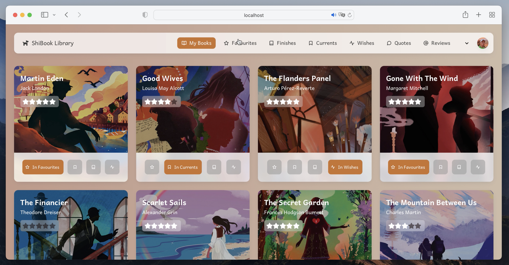
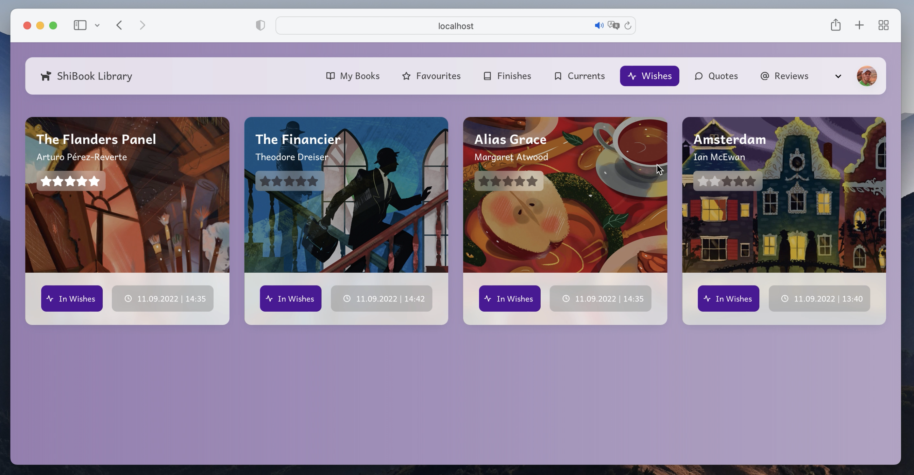
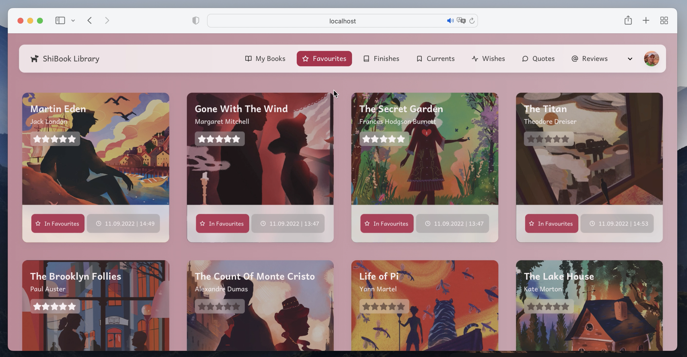
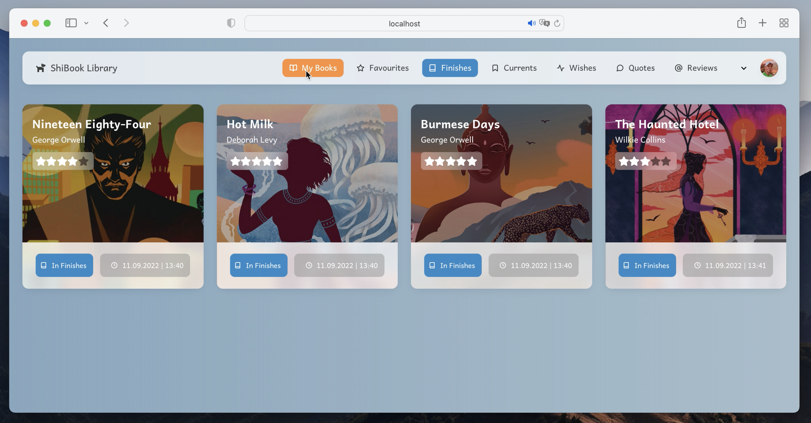
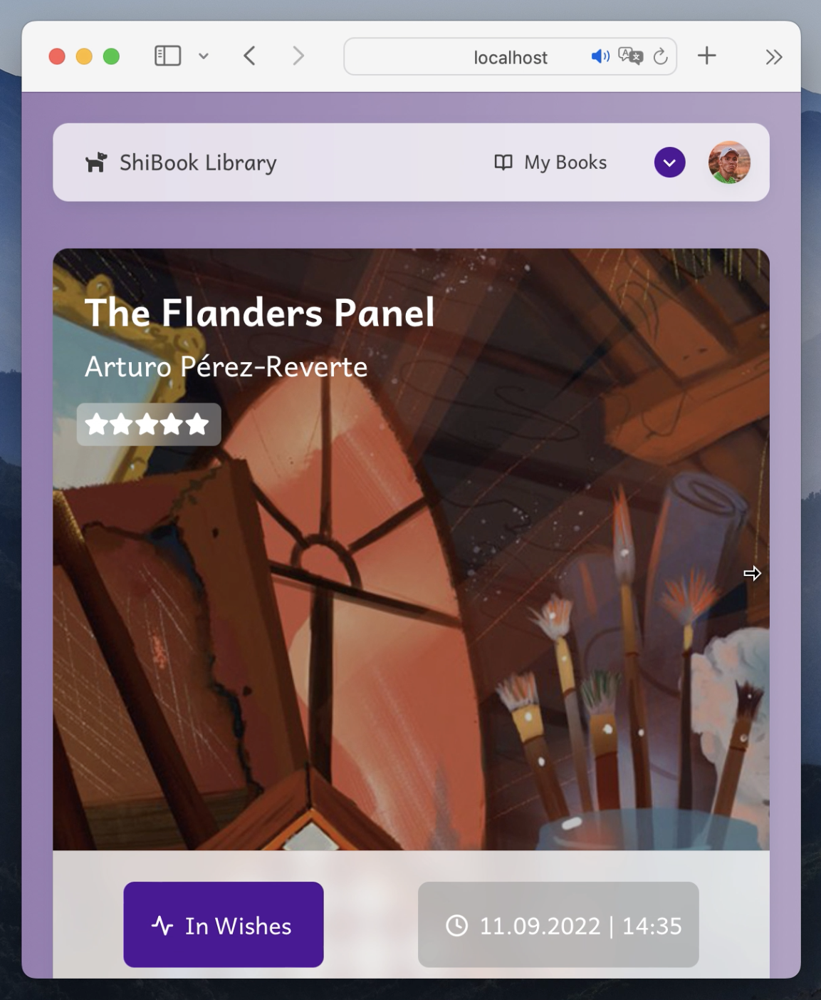

# Book Library

### This project was written in React.JS

This project is about book interaction - you can consolidate every "book move" right in this application.

There is a small review of the application below.

All books page. As you can see, it has modern card interface:

You can add books to wishes:

Or favourites:

Or finishes, and so on:

Besides color change, the web page is adaptive:

Upper fixed header can shrink itself while scrolling:

But options are still available:

